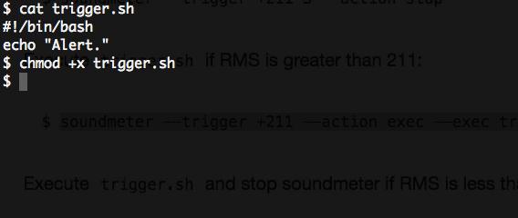

SoundMeter
==========

[](https://pypi.python.org/pypi/soundmeter "soundmeter on pypi")

SoundMeter is a command-line tool to obtain sound power in real time. It
basically turns the audio recording functionality into a sound meter for
machines that ship with audio input devices (e.g. microphone). It
currently reveals the [root-mean-square (RMS) of sound fragments], which
is a measure of the power in an audio signal. The actual values also
depend on the system settings of sound input.



Features
--------

-   A command-line meter that supports triggering upon events
-   Monitor API for backend module programming

Dependencies
------------

### System packages

On Debian/Ubuntu:

    $ sudo apt-get install portaudio19-dev python-dev alsa-utils

On Fedora/RHEL:

    $ sudo yum install portaudio-devel python-devel alsa-utils

On OS X:

    $ brew install portaudio

### PyPI packages

-   argparse
-   pyaudio
-   pydub
-   python-daemon

Installation
------------

You can install the package with pip using the following command to
allow externally hosted packages:

    $ pip install soundmeter --allow-all-external --allow-unverified pyaudio

Or, you can download a source distribution and install with these
commands:

    $ python setup.py install

Usage
-----

The simplest usage is to run “soundmeter” from command-line without any
options:

    $ soundmeter

Collect RMS values for 10 seconds so that you will know the sound level
in the current environment:

    $ soundmeter --collect --seconds 10
    Collecting RMS values...
       154  Timeout
    Collected result:
        min:        152
        max:        211
        avg:        156

You can set trigger and action for soundmeter.

Stop the soundmeter if RMS is greater than 211 consecutively for 3
times:

    $ soundmeter --trigger +211 3 --action stop

Execute `trigger.sh` if RMS is greater than 211:

    $ soundmeter --trigger +211 --action exec --exec trigger.sh

Execute `trigger.sh` and stop soundmeter if RMS is less than 152
consecutively for 3 times:

    $ soundmeter --trigger -152 3 --action exec-stop --exec trigger.sh

Run the soundmeter with trigger and action in the background:

    $ soundmeter --trigger +211 3 --action exec --exec trigger.sh --daemonize

Run the soundmeter for 2 minutes and log to `meter.log`:

    $ soundmeter --seconds 120 --log meter.log

### Command-line Options

The “soundmeter” command accepts the following options:

```
  -c, --collect  collect RMS values to determine thresholds
  -s SECS, --seconds SECS  time in seconds to run the meter (default 
forever)
  -a ACTION_TYPE, --action ACTION_TYPE  triggered action (``stop``, 
``exec-stop`` and ``exec``)
  -t THRESHOLD, --trigger THRESHOLD  trigger condition (threshold RMS and 
an optional number of consecutive triggering times, which defaults 1)
  -e FILE, --execute FILE  shell script to execute upon trigger (defaults 
to ``~/.soundmeter/trigger.sh``), can be configured to pass the "last 
triggering" RMS value as argument by setting ``rms_as_trigger_arg`` to 
``True`` in ~/.soundmeter/config
  -d, --daemonize  run the meter in the background
  --log LOGFILE  log the meter (defaults to ``~/.soundmeter/log``)
  -v, --verbose         verbose mode
  --segment SECONDS  audio segment length recorded in seconds (defaults to 
0.5); when specified, it overrides ``audio_segment_length`` in 
~/.soundmeter/config
```

  [root-mean-square (RMS) of sound fragments]: http://docs.python.org/2/library/audioop.html#audioop.rms